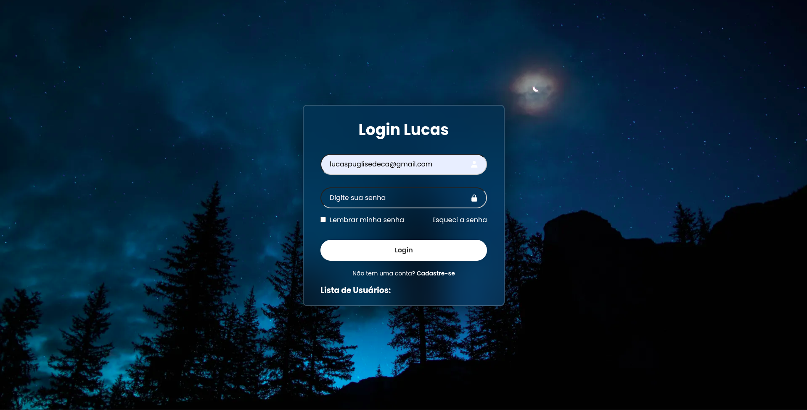

<h1 align="center">🌌 Site-Login: Sistema de Autenticação</h1>

<p align="center">
  
</p>

## 📖 Sobre o Projeto

Este projeto foi desenvolvido como parte das atividades da **Monitoria de Desenvolvimento Web** durante o meu 1º semestre no curso de **Ciência da Computação no CEUB**.

O objetivo principal foi criar um sistema de login funcional e responsivo, aplicando os conceitos fundamentais do desenvolvimento Web Full-Stack. O projeto vai desde a concepção da interface visual (Frontend) até a estruturação do servidor e banco de dados (Backend).

## 🚀 Funcionalidades

* **Interface de Login Moderna:** Design limpo e atraente utilizando o efeito *Glassmorphism* (vidro fosco) sobre um fundo temático.
* **Autenticação de Usuários:** Campos para e-mail e senha com validação estruturada.
* **Integração com Banco de Dados:** Consumo de API própria para validação de credenciais e operações com usuários.
* **Estrutura de Navegação:** Links preparados para "Lembrar minha senha", "Esqueci a senha" e "Cadastre-se".

## 💻 Tecnologias e Ferramentas Utilizadas

A aplicação foi construída separando as responsabilidades entre cliente e servidor, utilizando as seguintes tecnologias:

### Frontend (Interface do Usuário)
* **HTML5:** Estruturação semântica da página.
* **CSS3:** Estilização avançada, uso de variáveis, flexbox e efeitos visuais como desfoque e transparência.
* **JavaScript (Vanilla):** Lógica do lado do cliente para manipulação do DOM e consumo da API.

### Backend & API
* **Node.js:** Ambiente de execução para o servidor construído em JavaScript.
* **Express.js:** Framework para criação da API RESTful, gerenciamento de rotas e middlewares.
* **NPM:** Gerenciamento de dependências e pacotes (`node_modules`).

### Banco de Dados
* **PostgreSQL:** Banco de dados relacional robusto utilizado para armazenar as credenciais e dados dos usuários de forma segura.

## 📂 Arquitetura do Projeto

O repositório está organizado de forma modular, separando nitidamente o backend do frontend, além de seguir boas práticas de organização de API:

```text
Site-Login/
├── api/                        # Backend: Servidor Node.js e banco de dados
│   ├── config/
│   │   └── db.js               # Configuração da conexão com o PostgreSQL
│   ├── models/
│   │   └── usuario.js          # Modelo de dados da tabela de usuários
│   ├── routes/
│   │   └── usuario.js          # Definição das rotas da API (ex: /login, /usuarios)
│   ├── app.js                  # Configuração principal da aplicação Express
│   ├── index.js                # Ponto de entrada que inicializa o servidor
│   ├── package.json            # Dependências e scripts do backend
│   └── package-lock.json
├── frontend/                   # Frontend: Interface estática
│   ├── img/
│   │   └── página-login.png    # Imagens e assets do projeto
│   ├── index.html              # Estrutura principal da página
│   ├── script.js               # Lógica de integração e requisições HTTP
│   └── style.css               # Estilização visual (Glassmorphism)
├── .gitignore                  # Arquivos e pastas ignorados pelo Git (ex: node_modules)
└── README.md                   # Documentação do projeto
```

## ⚙️ Como executar o projeto localmente

Para rodar este projeto na sua máquina, você precisará ter o [Node.js](https://nodejs.org/) e o [PostgreSQL](https://www.postgresql.org/) instalados.

### 1. Clone o repositório

```bash
git clone https://github.com/lucaspuglise/Site-Login.git
cd Site-Login
```

### 2. Configurando o Banco de Dados (PostgreSQL)

* Crie um banco de dados no PostgreSQL.
* Insira as suas credenciais locais (usuário, senha, nome do banco, porta) no arquivo `api/config/db.js`.
* Crie a tabela de usuários necessária para a aplicação funcionar.

### 3. Configurando o Backend (API)

```bash
# Entre na pasta da API
cd api

# Instale as dependências
npm install

# Inicie o servidor
node index.js 
# ou npm start (dependendo do seu package.json)
```

### 4. Rodando o Frontend

* Como o frontend é composto por arquivos estáticos, você pode simplesmente abrir o arquivo `frontend/index.html` diretamente no seu navegador.
* Para uma experiência de desenvolvimento melhor, recomenda-se usar a extensão **Live Server** do VS Code.

---

## 👨‍💻 Autor

**Lucas Puglise**
* Estudante de Ciência da Computação - CEUB
* GitHub: [@lucaspuglise](https://github.com/lucaspuglise)

*Este projeto foi feito com dedicação para fins de aprendizado e aprimoramento em Desenvolvimento Web.* 🚀